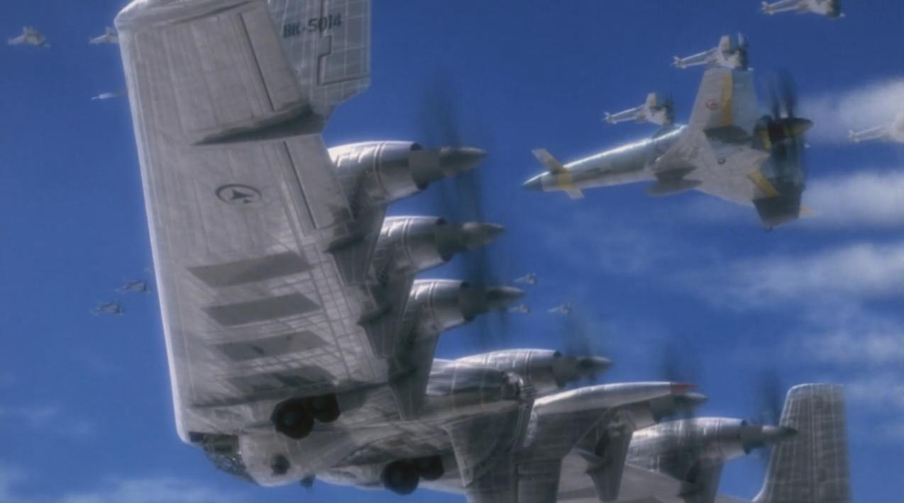

## 世界 |　Codex

### 000 自然法则 Nature Doctrine
- 动量守恒定律、能量守恒定律以及角动量守恒定律 三大基本守恒定律。

### 001 深空航行 Cosmos Dive
- 在那未来，庞大的星舰群航行在深空中（DEEP SPACE TRAVEL）。
- 深空舰群（DeepSpace Ship Assembly）是由一定数量（>1）以上的舰队组网形成去中心化的深空航行方案。
- 星舰群在航行的过程中不断增加自身舰船数量，但数量到一定程度舰群就会分离。
- 每个舰队都拥有一艘旗舰，在舰群分离后，会提升一个旗舰成为新舰群的核心（root）。

### 002 高维 Extra-Dimension
- 处于三维世界观测范围以外的空间，被称为高维空间。无法通过电磁力，强力，弱力判断其存在，能通过引力寻找到。
- 关于高维物质，根据动量守恒推测，当沿着更高维度方向作用力于高维物质产生对应的高维动量，实现高维运动，也就使在其维度空间实现跃迁。这是跃迁引擎的假定原理。
- 高维物质在三维空间表现是其切片的投影。
- 操作高维物质需要能操纵相对低一维空间的能力
- 同维度的空间操纵技术已经能实现曲率飞行了
- 关于跃迁引擎（jump），涉及到对高维物质甚至空间的操作，所以其前置科技是基于空间操作的曲率引擎（warp）
- 对于高维物质的理解，复数零维点的集合是二维线，复数长短一致的二维线（二维圆框架）的平面旋转集合是二维圆，复数二维圆的集合是三维球，复数三维球的集合是四维球框架，四维球框架沿无数的自转轴旋转形成四维球，

### 003 超光速 FTL
- 关于光速，光速不可突破。
- 不论是以何种形式就算上边讲的曲率（warp）或跃迁（jump）本质上都不无法实现超光速。这两者本质是在当前维度或高维空间中设法缩短两点间距离（把纸折起来）或找到两点间在高维空间中的最短距离。
- 关于光速可变，

### 004 引力:空间曲率 Gravity:Curvature of space 
- 关于引力，空间操作。其基础原理假定是奇点周边空间会形成异常强大的引力场。
- 这个假定的奇点引力效应不光在宏观黑洞中成立，同时也在微观物质高能碰撞时也会发生，只是规模和持续时间比起自然天体黑洞是不同数量级。
- 基于这个猜想，利用高能加速器加速物质并使之碰撞，极短时间内一点物质达到或突破钱德拉塞卡极限形成中子态物质或微奇点，实现微观高磁场或空间坍缩，掀起空间的涟漪。
- 接着利用微观这点进行大批量化产生控制和运作，实现一个足够星际载具级规模的空间操作。
- 三维物质突破钱德拉塞卡极限所需的能源过于庞大，而高维物质突破极限所需的能量则会少很多，人工奇点多数都是用高维物质制作而成的。
- 通过干涉空间，曲率引擎（Warp Driver），实现对已有基于初速度的倍化形式的加速，可总速度仍在光速限制内。
- 曲率引擎，也遵循动量守恒定律、能量守恒定律，最终实际得到加速能量小于总能量，其做法是使用大量能量创造出一个适合加速的空间环境，在这个环境内使瞬时加速度得到倍化。
- 总得来讲，曲率更类似人造引力弹弓，但是一种随处可用的引力弹弓。（把星体的引力类比成风，过去运用引力弹弓的星际飞行器就是滑翔飞机，那么装备了曲率引擎的星际飞行器就是喷气式飞机）
- 当技术上能激起三维空间的涟漪甚至浪花时，操纵四维物质就已称为可能，剩下就是探索采集四维物质碎片。
- 无工质引擎（EMdriver）不存在
- 四维物质是实现高维移动（跃迁）的必需品，根据动量守恒，想要获得第四个维度的加速度，那就只能使用对应维度物质来获取相应的动量。

### 005 旗舰 Flagship 
- 关于旗舰，旗舰是舰群的节点，同时也是一个舰队的中枢。
- 旗舰（flag node）专注深空航行，具备完整的高维观测和高维移动（跃迁）能力，没有降落在星球上的能力。
- 旗舰上储存着完整的科技，具备离群独立航行（independent）和独立生产下一艘旗舰（genesis）的能力。
- 一个完整的旗舰（flag node），其下有多艘（>1）专注某个区划功能（生产，科研，战斗，殖民，居住）的功能船。（Leaf node）
- 功能船在经简易改装后能降落在星球，同时在一艘Leaf级的基础上上，扩张建造。
- 旗舰的所有功能分散在数量众多功能船之中，即使出现旗舰都被损毁的情况，只要剩下足够的功能船(LEAF级），也能再造一艘旗舰。
- 由于无法制作出完全适应宇宙各种复杂恶劣环境下的通用计算机，于是旗舰上安装了多套互相协调互通信息互为兼用的各类计算机——经典电子计算机（在高能粒子环境中易被干扰），量子计算机（在温度过高的环境中易被干扰），光子计算机（易受引力干扰，不适用于曲率跃迁飞行），生化计算机（基于离子交换开发的活体脑计算机）（目前该生体离开了旗舰降落在天门V，Lili和Rere）
- 旗舰一般是以活体计算机为主控其他种类计算为辅控。
- 旗舰是舰群在进行高速移动的最小单位，负责携带管辖的居住船/殖民船（LEAF）进行曲率航行或跃迁航行。
- 旗舰有基本的自给自足生产系统，但旗舰更多的扩展功能需要LEAF配合才能启用。
- 旗舰是星际战斗中一般是核心指挥单位，也是首要保护的单位。
- 旗舰装备有术士（colossal/warlock），一种封装了针对可预见威胁的尖端技术的战争平台。一艘旗舰上的每一台术士都是独一无二——星际战争上武器模板（类似抗体）。这种模板在面对威胁时，如果用得上，就会以这个技术模板进行大规模批量化生产并快速投入战争，如果用不上就需要开发新的模板。（类似重新产生新抗体机制）
- 有的术士专注对有机生命体敌人，有的专注机械体敌人，有的专注对具备高维技术的，有的专注对 术士敌人，还有的专注对舰群（原则上禁止）。
- 术士是舰群中不同舰队开发并分发给其他旗舰队，作为战争技术储备，因此有的 术士并不是这艘旗舰生产的，甚至带着未知的技术原型装备。
- 旗舰目前在泰星系的近日轨道中巡航
  
<!-- 
### 006 泰星 Terra
- 关于泰星，昔日的主已离去，留下它们的生化仆从——泰麒麟（TEKELI）
- 泰麒麟，一种无固定形态如同泥巴一般，却又变化自如的奇特生命体。蜂群意识物种，以阳光和捕食矿物为食。
- 泰麒麟在主离开后在这座星球地面上和地面下继续建造着无数的建筑。
- 泰星年约等于两个地球年，按地球纪元惯例，人类将之分为夏季年和冬季年。
- 百年前，一艘受损的旗舰带着数艘LEAF级居住/居住船来到这个星系边缘，舰队已经无法继续航行下去了，居住船选择了在泰星上迫降，旗舰停泊在近恒星轨道修复等待。
- 在降落后人们发现这个星球上的生物并非原生的，它们是被留下来的。
- 在泰兴第二个十年，为了争夺生存空间，人类与泰麒麟爆发了一场大战。历经十年征战，泰麒麟赶到泰星不连片的海洋里。
- 在第三个十年末，沐浴着穿透了大气尘埃的阳光的泰麒麟从海里朝人类发起巨大的反扑，最终双方停战告终。
- 人类因舰队受损迫降同时经历两次与泰麒麟的战争，因人口过少出现了严重的文明退化效应（塔斯马尼亚岛效应），此时人类对科技认知水平与二十世纪五十年代相近。
- 泰星对是一个陆地面积比海洋面积大的宜居星球的统称。陆地面积极广，同时有好几个大湖，陆地下有极其发达的地下河流系统，连通各大湖面。
- 因地下水系发达，泰星上还有大片的外星森林，森林以极深的根系到达地下吸收水份。
- 泰麒麟守护着大海与森林，纵使人类毁灭不少森林，第二次泰麒麟大战中，数亿泰麒麟从海中涌出，在战后以自身的尸体为苗床，在大陆上重新生成了不少森林。 -->

### 006 气态游星 天门 Ten'Gate
- 天门，一颗气态游星，流浪于。
- 质量和体积参数与太阳系土星相似，无行星环，有五颗卫星。
- 天门庞大的大气层中存在分层现象，存在着含氧、压强、磁场、重力等适合人类生存的巨大空域。
- 天门上存在着独特的气星生态，同时存在着一种有具智慧的类生命体，修格斯 XOKOS。

### 007 r20200725 人类 Lilin 
- 关于人类，经历宇宙世纪与星舰纪元的人类Human（人工）演化出了宇宙适应性和行星适应性。
- 无数星舰进入深空的时代，人类Human逐渐演变为夜灵Lilin（the night spirit）
- 由克隆工厂依照模板修饰后生出的大量人口。
- 天门五上存在两个人类物种，一类为宇宙适应性，一类为重力环境适应性。
- 通常下lilin不具备性别，适应各种强辐射环境，寿命是160-900年。
- lilin可以通过一定的手段触发自身产生性别转换，其过程不可逆转。
- 
- 在天门五降落后，根据气态行星环境对殖民地居民在基因上进行行星适应性修正。
- 在重力环境下由人生下的孩子都具备初始性别，正常寿命为55-140岁。
- 
- 在降落历20年代末，人类在天门大气层内及卫星上发现数座远古外星遗迹群。
- 在古外星遗迹群被公开后，人类阵营从降落时的航行派（唯物集权），分化出停留田园派（亲外唯心和平）。
- 在第二次佐格斯战争后，文明退化效应日益显著，田园派思潮逐渐盖过航行派思潮。
- 田园（唯心派——笼灯结社（Lantern Association L.A.)，
- 航行（唯物派——人类宇宙航行联合体（Lilin Cosmonautical Consociaty L.C.C.）

### 008 动力兵装 V.A.T.
- 关于VAT（人型 异型 容器，Versatile Automatic Tactic Suit）
- 基于动能主动防御系统K-APS(Micro Kinetic-Active Proctect System)下，发展出来的动力装甲。
- VAT原本是一种运用在外空间作业的动力骨骼，其装备的主动防御系统主要应对空间漂浮物的伤害，随着发展和运用迭代出人型系列（Humanoid）和 奇型系列（Grotesque）。
- VAT的人类控制接口通常有4级操作权限，3级动作同步，2级逻辑同步，1级感官同步，0级知觉同步。
- 常规VAT最多只有前3级功能，高端VAT有4级，特制VAT有负级功能。
- 负级为知性映射，-1级为感觉映射（感官），-2级为逻辑映射（动作），-3级是最后一级，知性映射（思考）。
- 第一章的红在过去宇宙时代早已失去原来的身体，她的意识一直活在特制的VAT中，依靠将知性映射到复制人身上，才以“一个人”的姿态出现在众人面前。
- 知性映射系统（Sapient-Mapping），通过侵入式工具将生物脑与机械脑进行映射。
- 知性映射（设定取自GHOST IN THE SHELL:INNOCENT），早期因技术不成熟，存在对驾驶员生物脑产生不可逆转地损害的问题，因此留下臭名昭著的外号——知性剥离Sapient_Peeling（现做该系统内的报错名词）。
- 另外对优异的驾驶员的机械脑，会提取其有益部分制作相应的知性映射集Sapient_Atlas，供辅助操纵系统或自动兵器系统实现二者共感、共知、共思。
- 知性剥离问题，是因为生物脑与机械脑之间的映射失真Mapping_Distortion（信息丢失，信息不同步、信息错误、信息超量、信息缺失等）导致的原生物体的大脑受损，因为映射循环从而进一步恶化，致使原体精神崩溃，思考停止（意识死亡）。
- 知性剥离问题随着技术发展，已处在可控的范围内了。
（如运用初期映射连续一个小时驾驶员便会崩溃，如今理论上能稳定维持到20年-30年甚至更久）
- 若驾驶员死亡，其机械脑仍能接替他进行思考。单纯的机械脑虽然在原体死去后仍能保持一段时间的正常思考，随时间变长处理的信息更多，机械脑会出现老化问题（aging）。若老化问题到一定程度不进行处理，机械脑进入思考停止状态。
- 机械脑规避aging的办法，一种是将其还原到以前稳定时期的数据，丢失一部分后来的数据。
- 规避aging还有一种方法是选取一个正常人，其生理和心理尽可能的与原体相似，然后与其建立新映射，这样能保证机械脑可持续地正常思考。因机械脑信息量巨大，通常与之建立映射的个体发生知性剥离的现象更为严重。
- VAT可采用远程遥控的方式进行。
- 远程操控延迟问题()
- 关于对人战斗，一旦在近距离发现目标，对人型VAT即会发出强光噪音波干扰人类战斗能力
- 灵能生命（高维生命、例如主宰）在现有宇宙活动，也需要对应的容器：知性容器、知性兵装。
- 动力兵装的知性映射是对知性容器的仿造，因lilin和human的知性已经在当前这个宇宙固定下来了，除非其进行过额外的升维仪式，知性剥离是无法避免的。

### 009 濒海十七城 City Littroal-17 
- 关于濒海城，人口500万，半径10公里的浮空都市。
- 以反重力桩为中心，半径超过5公里的圆盘为承重结构。
- 按圆盘划分为上城区，中间层，下城区
- 上城区高楼林立，中心是巨大的中央塔，塔一侧是人工太阳。
- 中间层是承重的圆盘，除了承重结构，还有建设，交通，管线，避难所，中间层外围是民用空港。
- 下城区主要是额外支撑结构以及发电区、工业区
- 濒海17号，City Littoral-17 ，L17，是开端。
- 濒海城同时也是人类与XOKOS之间的前沿据点。

### 010 企业 Enterprise
- 关于势力，主要分成两大派，两大派系下，以各区划的财阀和各方势力为代表参与其中，组建联合政府。
- 旗舰银行      Bank of Flagship
- 天门银行      Bank of Ten Gate
- 聚合能源      Joint Energy.
- 铩羽防卫      Sawing Defense
- 櫆航司        Dipper Navi
- 三〇工程      30 Engineer
- 三一精密      31 Precision
- 三二动力      32 Dynamix
- 三三总造      33 Manufacturer
- 硝子仪器      Zyouz Instrument
- 楔业          Wedge Enterprise
- 黑森林        Schwarzwald Sociation
- 大岚          Thran 
- 西京          Saikyo
- 斌资本        Bin Capital
- 霄星          Hiosum(HS)
- 东亚重工      TOA Industry
- 悬铃木        Platanus Quantum Computin
- 灵知网络      Pleroma Fediverse
- 青工业        AO Industry
- 霁月          Over-moon
- 祟智          Elf Intelligence

- 炎种子        Forge Seeds

- 

### 012 出地球记 Post-Exodus
- 出地球记，人类离开地球的记事
- 在二战后，人类经历一段相当漫长的和平岁月，
- 随着气候变化、地质演变，三战发生了，
- 三战是一场短暂的战争，
- 在那之后的人类在燥热、充满辐射尘埃的环境里，建造了不朽的智慧网络，依靠智慧网络人工演化出来辐射适应性。
（new idea：热砂时代 Sand-heart）
- 随着深空技术的发展，开始移民宇宙，从此进化成跨行星物种
- 刚刚离开地球的人类，很快在太阳系内发现了外星智慧生命的踪迹:“主宰”（Domain）（一种灵能实体物种）、“旧神”（Old ones）（一种基于电子科技的太空歌剧种群，人类与其类似）、
- 并知悉了真正的地球历史————一座"旧神"用作囚禁知性的监狱。
- 在侦测到一场恒星规模的灾厄即将发生之际，人类的深空舰队开始向无际的宇宙出发。
- 深空舰队每来到一个新的星系，消耗掉星系的资源，逐步建立更多星舰，往更遥远的宇宙深处探索。

### 013 殖民船 Leaf-Ship/Seed-Ship
- 关于Leaf级生产船，Leaf生产船是舰队中基本的功能单位。
- Leaf级在深空航行时，为滚筒状，在降落殖民时，类似一把倒着撑开的伞。
- Leaf级往往专注于某个功能区划，多个leaf级多个区划连接在一起组成一个基本的区块。
- leaf级有两种建造方式，一种是在深空中建造，一种是在地面上建造。
- 除了leaf级居住生产舰还有Fang级的攻击舰

### 014 高维入侵 Extradimension Invade
- 关于高维入侵
- 这点是借鉴the 3rd birthday，暂时没什么好讲。

### 015 黑森林  Schwarzwald
- 关于黑森林  Schwarzwald 20190822
- 黑森林 是一个半公开的中立佣兵协会，负责对泰星上所有佣兵（以物质为报酬，提供军事服务的个体或组织）进行管理。
- 黑森林本身是没有任何立场的，它只是为那些猎手提供方便的信息交流平台。
- 黑森林还独立的作为第三方对所有战斗人员，不管他隶属什么组织，对其进行能力评价。

### 016 纳米修复材料 Nanites repair system
- 关于自修复材料
- 自修复材料是基于纳米技术生产的细胞大小的机器人构建的材料，核融合炉框体的核心材料。

### 017 宇航联 Cosmonautical Consociety of Lilin
- 关于宇航联 Cosmonautical Consociation of Lilin C.C.L.
- 宇航联是舰群的联合政府，其目的是保证舰群永久（permanent）航行下去。
 

### 018 隆灯会 Lantern Association
- 关于隆灯会 Lantern Association
- 隆灯会是舰群内的反联合政府组织，反对毫无目的地所谓永久航行，寻找更为合适的生存方式。

### 019 柴铜苍穹  Bronze Hemisphere
- 关于柴铜苍穹  Bronze Hemisphere
- 一个巨大的数据管理组织，运用多种方式储存了舰群从最初到现在所有的重要数据。
- 柴铜苍穹存在的目的主要是保存重要数据，还有应对“至暗”。

### 020 至暗（永夜） Blackout
- 关于至暗（永夜） Blackout
- 对舰群航行中所发生的大范围停电事件的一个事件名词。
- 事实上，舰群在深空航行中经历过数次至暗时刻，时间长度从毫秒到数天不等。 存在记录有些舰群在非常漫长的至暗中毁灭。
- 在至暗里，所有的电能都“消失”了，同时对于所有通电工作的电器都产生极大破坏。
- 在残存的舰群进入泰星星系前，曾发生过一次长达一周时间的至暗，对舰群造成了巨大损害，导致大量未储存进柴铜苍穹的的数据遗失。
- 此外，在高维空间和物质实验中，也会发生过区域性的至暗。
- 后经证明了，至暗是由于时空波动造成微观粒子的物理参数发生变化，从而导致宏观上停电现象。
- 舰群在进行高维航行时，会频繁的遭遇至暗现象，一般是有应对的
- 但在日常航行中，遭遇至暗是一场灾害。
- 至暗对深空航行中的给人的意识准备的计算机虚拟空间（大都会， metropolitan，类似matrix世界）有非常巨大的损害。

### 021 大都会 Ecumenopolis Metropolitan Matryoshka Brain Matrix Centropolis
- 关于大都会 Ecumenopolis Metropolitan （Matryoshka Brain 马托里斯卡之脑 小型版）
- 大都会是一个有计算机做底层硬件，构建出的一个虚拟城市世界。（类似Matix世界）
- 泰星有两个公开大都会，一个在地面上，有一个在旗舰上。
- 地面上的大都会之前受限于能源供应仅仅维持其核心区块，随着新核融合炉的制造成功重新开始启用。
- 旗舰上的大都会其数据受到至暗影响，至今仍在恢复作业中。

 
### 022 Sapient AI (Sentient AI、Sentinel)
- 关于AI。
- 目前没有什么好讲的。

### 023 Gas Planet City
- 关于气态行星世界
- 

<!-- ### 024 相位星球 Phased planet
- 关于相位星球
- [Root.GetName]报告说我们在[phaseshift_planet.GetName]星系内新获得的星球展现出了一些非同寻常的特性。它被一种只能称之为灵能的能源所包围，[phaseshift_planet.GetName]每单位空间内的量子叠加态数量，超出了至今为止被认为是可能数量的上限。
每隔三个月，叠加态数量就会达到临界值，使[phaseshift_planet.GetName]经历一次彻底的维度相位转移，它的粒子场将会旋转进另一个维度。该旋转会将一个虚境星球从另一维度转移至我们的维度，然后在下一个周期结束时再次转移回一颗盖亚星球。 -->

### 025 莱卡
- 我记得有一条狗，叫莱卡(莱卡，俄语中，吠叫的意思）。
- 60年前，它是第一个进入绕地球轨道的地球生物,也是第一个死在地球之外的生物。“它嗥叫了好长时间”，技术员说：“这太可怕了，一头孤单的狗，单独的在宇宙之中，嗥叫”

### 026 台风 Typhoon
- 关于台风，因水文环境在大片水域上生成的热带气旋，常发于夏秋季节。

### 027 原子能 Atomic
- 关于原子能，分裂变能，聚变能。
- 本作集中出现两种堆，聚变裂变混合增殖堆，实验聚变堆。
- 濒海城的堆属于混合堆。
- 混合堆使用聚变部作中子源，将铀238/钍232 转化为可使用的核裂变燃料，从而进行发电。
- 实验聚变堆，由于长时间深空航行和两次泰星战争，人类科技水平发生退化，已经没有能力新造一个跟古老的飞船上同样等级的聚变堆了。由此生产能力发展产生的能源需求，因此推动的实验聚变堆发展

### 028 快子 Tachyon
- 超光速物质,跨过光速壁垒的物质世界
- 具有虚质量（Imaginary Mass）
- 又名暗光子 Dark Photon

### 029 亚空间 Subspace 
- 

### 030 阿卡夏 亚空间计算机 | Akaxa the Subspace Computer
- 一座位于独立亚空间的超级计算机，通过快子信号和分发的量子纠缠通讯器与外界交流。
 

### 031 灵能 Psion/Shining/Magic 
- Psionic灵能神经回路技术
- FOG（field of ghost）幻域技术
- 
<!-- ### 032 二维世界与微生物
-  DNA RNA等可编程序列化分子是二维文明操作三维物质的解决方案。
- 二维生物通过某种形式将自身的信息转化成DNA RNA等三维世界的可编程物质，从而实现升维。
- 以可编程DNA RNA分子为内核的三维微生物就是二维生物在三维宇宙航行的载体。
- 在深空航行中的舰群，莫非也是四维世界中的微生物？ 
- 在旗舰的数据库中，曾记载着对星系中央巨大黑洞集群的观测记录
- 其中存在有黑洞的视界上存在异常空间扭曲现象，同时分离出不明发光云状物（void wind）-->

### 033 航空器命名 | Aircraft Naming
- 空天：鹭，鹰，鸢，鹫，骛，鸳，鸯
- 大气圈：鸿，鸦，鹂，鸥，鸽，鹊，鹃，鹤，鸠，鹉，鸩，鹘，鹏
- 独立：雀，燕，蜂，雉，雕，乌，隼，雁

### 034 梦神 Morpheus
- Morpheus 梦神，一种使受体进入无尽的睡梦中的纳米机械药剂。
- 受体会进入无痛苦的长眠，进入假死。
- 用于长期冷冻睡眠，外太空漂流，无知觉处刑。

### 035 复杂电磁环境
- 气态行星复杂电磁环境，普通电磁波通许难以满足各种通讯需求。

### 036 有线通讯
- 受制于气态行星复杂的电磁环境，

### 037 激光通讯

### 038 大功率定向信号发射机

### 039 同步轨道量子通讯卫星

### 040 曲率引擎 | Warp Engine Alcubierre Drive

### 041 高维物质的捕获
- 0.利用电磁陷阱网络捕获最初的带电荷的高维物质碎片。
- 1.利用电磁质量加速器使高维物质进入奇点临界状态，产生巨大引力干涉时空。
- 2.通过精密的计算以及布局，制造出巨大的引力陷阱捕获更多的高维物质碎片。
- 3.加工高维物质碎片，使其带上电荷能被电能驱动。
- 回到第1步，以此开始循环。

### 042 星炬 | Interstellar Torch
- 0.基于高维干涉技术所创立的一种通讯技术。
- 1.传闻在过去，在亚空间有一座清晰明亮的星炬，指引着所有星舰团归去的方向。
- 2.随着银河系(Milky Way Galaxy)的星光变得黯淡，已无法观测到星炬。

### 043 反重力桩 | Gravity Pole
- 0.基于空间干涉技术的反重力装置。
- 1.天门星上大部分的人工浮空岛都是基于反重力桩而建。
- 2.反重力桩的核心（杆状物体），属于无法解析且无法生产的核心部件，
- 3.库存可以满足需求。
- 4.浮空城仅使用一个核心桩，外围区域的框架使用辅助桩扩展影响范围。

### 044 空洞宙域 大荒 | Great Void
- 0.银河系之间的空洞宙域，星光沉寂的地方。
- 1.大荒是一片陷入虚空（Void）的宙域

### 045 何罗生命 | Khoro Being
- 取自：“《山海经•北山经》：“谯明之山，谯水出焉，西流注于河。其中多何罗之鱼，一首而十身，其音如吠犬，食之已扈。”
- 一种（被设计的）太空生物（Spaceborne alien）
- 社会体系为蜂群意识(Gestalt Consciousness-Hive Mind)
- 一种无固定形态如同泥巴一般，却又变化自如的奇特生命体。
- 何罗母巢依靠体内的生物冷聚变产生活动能量，异常的高效。
- 何罗生命是一种具有多形态的生命,分为：何罗母巢（KhoroBrood，何罗拟态（KhoroMinicry），何罗孢子（KhoroSpore）。

### 046 何罗孢子 | KhoroSpore
- 何罗孢子是由 何罗拟态 释放出的一种孢子。
- 何罗孢子悬浮在大气中，吞食各种气体，富集聚变元素气体。
- 何罗孢子的遗传物质是由何罗拟态裁剪出的片段，其本身也具备无性繁殖的能力。
- 何罗孢子属于生态链下位生产者，被何罗拟态消费。
- 何罗孢子聚集起来形成巨大的孢子森林。

### 047 何罗母巢 | KhoroBrood
- 专指由巨量何罗拟态聚集形成的巢穴。
- 何罗母巢类似人类的都市，是蜂群意识独有的“建筑”。
- 根据数量级的不同，母巢也分为综合型、生产型、贮藏型、战斗型等。
- 第二次何罗战争中，人类第一次观测到处在气星深处巨大的综合型母巢。

### 048 何罗拟态 | KhoroMimcry
- 何罗生命的核心个体，具有强大的能量，变形（transform）、分化（differentiation）能力。
- 何罗拟态具有一种特殊的器官，能够消耗轻元素进行冷聚变，高效的产能方式。
- 这种突破常识的生命被人类学者认为应是由被设计出来的，而非自然产生的。
- 其基础细胞结构异常复杂，遗传物质被发现有明显的密码学加密痕迹。（分为不同的密码等级）
- 何罗拟态在气星大气中被观察到有着数百种形态的存在，初期观察到的个体是类似章鱼一首多身。
- 天门星上层的何罗拟态通常生活在巨大的浮空孢子森林中，看护着森林。

### 049 降临战争
- 人类与何罗的第一次战争，开端是人类扫荡孢子森林。
- 因大量战斗型拟态的参加，突然扩大为一场泛及天门星上所有人类空域的战事。
- 第一次天门战争结果以人类压倒性的胜利结束，部分孢子森林以及部分气星上层空域的被人类控制。
- 特殊事件：有闯入气星深处的侦测部队被消灭的记录。

### 050 何罗战争
- 人类与何罗的第二次战争，开端是何罗生命主动向多处浮空都市发起进攻。
- 从气星深处浮现出与81座的母巢，随即释放出大量拟态进攻浮空岛。
- 第二次天门战争双方都付出巨大代价，双方重新划定新边界。
- 战争中，大型都市12座残存4座，中型18座残存15座，小型33座残存32座，在建3座残存3座。(含西京共计67座)
- 双方以定期巡逻的方式告知边界。
- 特殊事件：首次观测到有拟态在外太空轨道活动。

### 051 浮空城市 | Floating City
- 悬浮于气星宜居层，依靠中心的反重力桩为支撑构建的人类城市。
- 分级为特大型（Alpha)、大型(Beta)、中型（Gamma），小型（Self-Sufficent），在建（Construction）
- 目前仅存一座特大型浮空都市————西京。
- 现存大型7座，中型12座，小型39座，在建4座，共计64座。
- 城市结构大类：1.基础(BASIC) 2.民生(Consume) 3.资源(RESOURCE) 4.科技(TECH) 5.战备(WAR) 6.特殊(X)
- 城市分为上城区（铺设地面，民众生活），中间层（建设拓展，管线，支撑机构），下城区（轨道交通，空港，资源储藏） 

### 059 五九式泛用动力甲 | VATS-59
- 五九式人型，第59天门年天门六第一机械厂参考旗舰上的深空作业服优化并量产的一种泛用机械作业服（Versatile Automatics)

### 060 枪械管制
- 在外太空，枪械和炸弹的使用会造成大量碎片，因此禁止一般民众持有枪械。
- 出于治安维稳需求，天门社会也实施枪械管制，但对刀具，气枪，投掷装置不做限制。

### 061 通用人类控制接口 | Universal Human Control Interface
- 一种基于神经系统的外部装置控制接口装置，cyborg设备。
- 可以通过手术安装在人体的背部脊椎。
- 最高配是跟一个人脊柱大小相等的外侵式脊柱。

### 062 动力外骨骼 | Dynamic Exoskeleton
- 一种配备动力及传感操作系统，为穿戴者提供进行额外的力量、以及保护的外部结构。

### 063 真理 武器系统 |  Truth Weapon System правда 
- 旗舰搭载的武器系统的代号。
- 留存在辞海中的占位符号，详情不明。

### 064 飞翼航行器 | Flyin Wing Aircraft
- 飞翼布局有着航程大、载荷多的特点。
- 于天门星上大量运用着飞翼航行器。
- 飞翼机于空港的起降有特殊的轨道，

### 065 玻璃宇宙球 | Glaze Glass Ball
- 用玻璃管烧制成的玻璃珠，内部的气泡与花纹宛如美丽的星辰。

### 066 准晶体 | Quasicrystal
- 一种介于晶体和非晶体之间的固体。
- 准晶体具有与晶体相似的长程有序的原子排列，但是准晶体不具备晶体的平移对称性。因而可以具有晶体所不允许的宏观对称性。 

### 067 统一场论 | Unified Field Theory
- 于地球公历20世纪，人们成功的将电磁力GED 强核力GCD 弱核力 进行统一的数理化描述，而最后的引力在地球文明结束仍未统一描述。
- 宇宙世纪期间，通过搭建规模化的人工智能平台MAGI，获取了关于统一场论的碎片（fragment不完整的描述）及推测结果。
- 统一场论的碎片启发了对曲率的实用化，和对亚空间的探索。
- 根据星舰历记载，有星舰团在接触了高级外星文明后，获取了原初及未来（远古太初黑洞及黑洞湮灭纪元）的观测数据后，完成了统一场论。
- 旗舰上大都会信息系统的某个休眠区块仍记载着这一重要的信息。

### 068 高维黑洞与膜世界 Extradim-black hole & Brane world
- 早在地球公历20世纪末期，就有相关理论提出当前的三维宇宙是四维黑洞坍缩的三维视界。
- 在星舰时代看来，这个理论是可观察现象的片面描述，宇宙更像一台无穷的可逆计算机，一切的空间和质能都是运行数据，过去与未来是同时进行的；时间是一根特殊的弦，使用特殊的仪器让意识游走在弦上，人能看到过去和未来，却无法改变，一切偏振都会归于静止...

### 069 超对称与多重宇宙 Supersymmetry &　Multiverse
- Supersymmetry 115GeV 超对称 一个仍有未知粒子产生的视界，一个充满创造与和谐的世界
- Multiverse 140GeV 多重宇宙 一个陷入无尽混沌的世界。
- 2012 Earth Higgs mH = 126.5GeV

### 070 货币 | Credit
- 占位

### 071 阿莱现象 引力屏蔽 | Allais effect gravitational shielding effect
- 占位
  
### 072 人工光合 | Artificial Photosynthesis
- 占位
  
### 073 重力井 | Gavity Well
- 占位
  
### 074 质量瘤 | Mass Concentration (Mascon)
- 占位
  
### 075 时间晶体 | Time Crystal
- 占位
  
### 076 5个标准差 | 5 sigma
- 占位
  
### 077 菌丝体-纤维素材料
- 一种运用人造菌丝体和纤维素生产的生物基材料
  
### 078 记忆水晶 | Memory Crystal
- 记忆晶体指使用光学工具在水晶介质上刻蚀形成的长时数据储存器
- 不同时代设计制作的水晶有明显的区别和特色
- 按读写方式分为只读和复写版本，复写版本的抗干扰能力较弱
- 按介质维度类型分为低维记忆水晶、高维记忆水晶
- 形状上，低维水晶多为盘状、圆柱体或立方体（自带读取回路版本）；高维水晶多为立方体，N棱柱、正球体（三维投影）。
- 标准：umc-universal smc-super hmc-hyper imc-infinite emc-extreme amc-avaritia

### 079 超轻玻色子 | Ultra-light boson
- 占位

### 080 负碳海藻 | LIMEWEED 
- 一种用于吸附二氧化碳的海藻，其体内会生成大量石灰结晶，采摘煅烧后可用作建材。

### 081 冷聚变 | Cold Fusion
- 聚变材料在低温状态下产生聚变的技术。

### 082 界外法则 | Outer Doctrine
- 形成于这个宇宙之外的法则，只有高维入侵时，这界外法则才会存在并影响。

### 083 脑蛞蝓 | Brain Slug
- 人造物，寄生物，以碳素有机体为寄宿体，携带历代宿主的知性、记忆、知识。

### 084 真空 | Vacuum
- 处于可观测宇宙中，处于亚稳定（MetaStable)希格斯场的区域（标量场，非零的希格斯场为许多基本粒子赋予了质量。）
- 2012 Earth Higgs mH = 126.5GeV(5σ)
- Higgs mH = (115,140)
- 真空具有的超低能量。
- 物理学家波尔津斯基(Joseph Polchinski)和布索(Raphael Bousso)当时正在研究弦理论，弦理论是描述量子引力的主要数学框架。弦理论只有在宇宙是10维的情况下才有效，而额外的维度会缩小到无法探测。波尔津斯基和布索在2000年计算出，这些额外的维度可以以多种方式折叠。每一种折叠方式都会形成一个符合自己物理定律的独特真空。
  
### 085 虚空 | Void
- 宇宙中，处于非稳定希格斯场的区域。
- Higgs mH (0,115]∪[140,∞)
- 二十世纪八十年代，物理学家科尔曼和德卢西亚描述了希格斯场的伪真空态是如何“衰变”的。在某个时刻，如果一些位置上足够多的钟摆摆动到了真正的真空——或者说虚无——所对应的更有利于稳定的角度，它们就会将它们的邻居拖到相同的角度，然后这个局域的真空会以接近光速的速度扩张。随着真空的扩张，目前的物理学将被改写，路径上的原子和分子将灰飞烟灭。（不过不必恐慌，即使我们目前的真空真的只是亚稳态，考虑到目前的稳定性，它也会再持续几十亿年。）

### 086 纤维素材料 | Fiber Material
- 占位符

### 087 即视感 | Deja Vu
- 似曾相识

### 088 灵能生命 | Psionic Entity 
- 一种高维生命在当前可观测宇宙的投影。
- 由知性和能量组成，它们最初应召唤来到这个宇宙中
- 灵能生命需要对应的知性容器，具现化
- 灵能生命不会死亡，但会失忆失格。
- 人类于太阳系中遇到的“主宰”即是一种灵能生命。

### 089 知性容器 | Sapient Vessel
- 用于容纳灵能生命的容器。

### 090 主宰 | Dominion
- 主宰于这个宇宙的降临时间与地点不明，唯一确定的是他们来到这个宇宙是为了一个不明的目的。
- 主宰是罕见的熵减生命形式，因为它们不断地为这个宇宙带来越来越多的信息。
- 主宰是充满秩序智慧的资源采集者，其控制空间搜集资源的目的不明。
- 主宰的名称是其学习了人类的语言后，告诉人类这是形容他们最贴切的词语。

### 091 安提凯希拉装置 | Antikythera Mekanism

### 092 洛伦茨吸引子 | Lorenz_Attractor