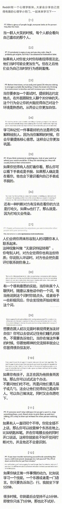

#### 20190724 | 马克思主义文库
https://www.marxists.org/chinese/index.html

#### 20190719 | Psychology Tip

#### 20190718
- 建议都实践尝试一段时间，积累点练习量。
> 不管是基础班，还是商业班，你完全指望它把你从白纸变成高手都是很困难的。
我个人是建议无论报什么班，都得先抽一段时间，比方说1-2个月，自己先练上一段时间体验一下再说（我以前发布的《预科作业》也带有这个目的），不要一冲动就想报班速成。

- 情况不一样，你的心态不能被一些运道、经历和你完全不一样的人左右，根据现在的实际条件和情况，制定现实的目标预期，恒温前行才是正道啊。

#### 20190708  
http://blog.sina.com.cn/fleetlong
> 1  
【转】以貌取人，绝对科学  
性格写在唇边，幸福露在眼角。  
理性感性寄于声线，真诚虚伪映在瞳仁。  
站姿看出才华气度，步态可见自我认知。  
表情里有近来心境，眉宇间是过往岁月。  
衣着显审美，发型表个性。  
职业看手，修养看脚。  
富裕或贫穷会从全身散发出来。 

> 2  
我也要求你读书用功，  
不是因为我要你跟别人比成就，  
而是因为， 
我希望你将来会拥有选择的权利，  
选择有意义、有时间的工作，  
而不是被迫谋生。  
——龙应台

> 3  
关于年轻人和游戏。  
如果说愚蠢又危险是年轻人喜欢去做的事情的特点，至少电子游戏不危险，更何况，在某些程度上，也不蠢。  
即便是蠢，也不过仅仅是浪费时间和精力而已，却能躲避各种信息的说教和洗脑。不是每一个个体都有机会觉醒，每一个个体觉醒的诱因也很难是一样的。  
叛逆主流的说教，寻求自我的独立，这原本是一件对于年轻人来说再正常不过的事情，游戏不过是众多方式中的一种。  

#### 20190701 
http://edu.sina.cn/?sa=t524d351597v1380&from=wap  
> [2012年1月17日 10:42]  
　　2011年末的《华尔街日报(博客，微博)》上刊登了美国经济学家法雷尔的文章《2012：美国“地狱十年”将更加黑暗》，文章为美国人描述了一个可怕的景象，2012年将是美国真正大萧条的开始，法雷尔预言：“超级富豪将在 2012年重掌政治体系中的绝对权力；中产阶级沦为第三世界的穷人；美国将在2017年爆发新内战和革命，美国将被占领；美联储和华尔街会在2018年垮台……”  
　　这段话让人直看得毛骨悚然。欧债危机将再度恶化，“占领华尔街”余波未消，美国的经济2012年似乎难以触底反弹。但在危机下的美国民众似乎没有多少悲观情绪，近期民调显示，2/3美国人对美国今年的经济持乐观态度。笔者圣诞节期间到访洛杉矶，看到这里的迪士尼乐园内依然歌舞升平，人山人海。  
　　迪士尼是美国经济的宠儿。  
　　越是经济萧条、失业人数上升、假期延长，迪士尼人就越多，娱乐业也越发达。相反，经济上升期，人们疲于奔命，反而少有娱乐时间。这就是所谓的经济周期“迪士尼效应”。  
　　娱乐产业是“疗伤型产品”  
　　迪士尼的创始人沃尔特-迪士尼就是在美国大萧条的1933年完成了第一部彩色动画片《三只小猪》，开创了百年娱乐大业。  
　　这场波及全球的金融危机中，迪士尼无疑是最大受益者之一。它通过米老鼠那双带着白手套的手向全世界播撒快乐，为经受着煎熬的人们提供逃避现实的港湾，微笑地看着人们本着“娱乐至死”的精神麻醉自己的心灵，当然也源源不断地把人们的钞票装进衣服口袋。  
　　娱乐产业具有强烈的社会代偿功能：生活欠你的债，艺术还给你。当通胀、失业带来的阵阵伤痛袭来时，带来了一系列心理问题：焦虑、浮躁、疲惫、抑郁等。当个人面对种种压力时，总需要寻求解脱和满足，暂时放下心理包袱，获得一种抚慰。娱乐产业恰恰成了人们心灵的港湾、负面情绪的载体。  
　　所以娱乐业是典型的“疗伤型商品”，除了迪士尼乐园外，还有很具典型意义的电影行业。  
　　上世纪二三十年代经济危机时期成为了好莱坞腾飞的关键时期。在经济最黑暗的1929年，好莱坞顺势举行了第一届奥斯卡颁奖礼，每张门票售价10美元，引来了众多观众的捧场。1930年的梅兰芳远渡重洋，在纽约唱响他的《汾河湾》，大萧条中的美国人一边在街上排队领救济面包，一边疯狂抢购他的戏票，5美元的票价被炒到十五六美元，创下萧条年代百老汇的天价。  

####　20190628 | 检验图 - 维基百科  
https://zh.wikipedia.org/zh-hans/%E6%AA%A2%E9%A9%97%E5%9C%96

#### 20190619
> 1.为人之道：  
低则杂，高为简  
无色令人目盲，五音令人耳聋，五味令人口爽；驰骋畋猎，令人心发狂；难得之货，教人行妨；是以圣人为腹不为目，故去彼取此。  
声色犬马，非淡泊无以明志，非宁静无以致远。
举世誉之，而不加劝；举世非之，而不加沮（阻）。  
柔光令人目明，清音令人耳聪，原味令人口恬，见素抱朴教人心淡泊。  

> 2.处世之方：
低则强（外强中干），高为随（上善若水）  
持而盈之，不如其已；揣而锐之，不可长保。
万物负阴而抱阳，冲气以为和。

> 3.养生之法：  
低则养，高为顺。  
致虚极，守静笃，万物并作，吾以观复。夫物芸芸，各归其根。归根曰静，静曰复命。  
人法地，地法天，天法道，道法自然。

> 4.谋事之术：  
低则“收”（得），高为“放”（舍）。  
得舍之间，舍得之道。  

#### 20190511
> 齑万物而不为义（戾）  
泽及万世而不为仁  
长于上古而不为寿（老）  
覆载天地刻彫众形而不为巧  
此之谓天乐  
——————————————————  
> THE GALAXY  
 TRILLIONS OF STARS    //长于上古而不为寿（老）  
WAITING TO BE EXPLORED  
> WHERE WONDROUS CREATIONS
MINGLE WITH DESIRES    //覆载天地刻彫众形而不为巧  
AND ENCOUNTERS WITH THE UNKNOW  
> 
> WHERE THE URGE TO GO BEYOND  
AND TO DETERMINE ONES OWN FATE    //泽及万世而不为仁  
IS UNIVERSAL.
> 
> WHERE FROM THE ASHES OF DEVASTATION
A NEW DAWN MAY RISE    //齑万物而不为义（戾）  
REVEALING A DEEPER UNDERSTANDING.
> 
> AND THIS SEEMINGLY ENDLESS GALAXY
IS STILL THERE.      
LINGERING  
WAITING  
FOR OUR NEXT MOVE  
KNOWING THAT IT IS GREATEST STORY  
STILL LIES AHEAD
> 
> AND IT IS YOURS TO TELL.
——————————————————————————
> THE GALAXY  
浩瀚银河  
TRILLIONS OF STARS  
亿万星辰  
WAITING TO BE EXPLORED  
虚位以待  
WHERE WONDROUS CREATIONS  
鬼斧神工  
MINGLE WITH DESIRES  
物欲横流  
AND ENCOUNTERS WITH THE UNKNOW  
未睹其二  
WHERE THE URGE TO GO BEYOND  
越古超今  
AND TO DETERMINE ONES OWN FATE  
自强不息  
IS UNIVERSAL.  
比比皆是  
WHERE FROM THE ASHES OF DEVASTATION  
华屋秋墟  
A NEW DAWN MAY RISE  
如日方升  
REVEALING A DEEPER UNDERSTANDING.  
意味深长  
AND THIS SEEMINGLY ENDLESS GALAXY  
灿灿繁星  
IS STILL THERE.  
依旧如故  
LINGERING  
缠绵悱侧  
WAITING  
FOR OUR NEXT MOVE  
伺机而动  
KNOWING THAT IT IS GREATEST STORY  
昭如日月  
STILL LIES AHEAD  
AND IT IS YOURS TO TELL.  
静候佳音
——Stellari Anniversary Trailor  
来自 群星周年宣传片  
——————————————————————  
生命是在这能量与物质熵增的宇宙中，燃放出不一样的火花。  
有生之年，唯一的妄想就是人类脱离地球圈，在宇宙中扩散，无论是以什么形式 。  
然后探知达到那更辽阔的世界，那更深远的未来。  
这把银色的钥匙深藏在我心中，每日每夜我都会用它去那片幻境中漫游。我知道每个人心中都有这么一把银色的钥匙，我也知道这把钥匙在漫长的岁月中迟早会不慎遗失。但我会————  
———————————————————————  
天之道，其犹张弓与？  
高者抑下，下者举之，有余者损之，不足者补之。  
天之道，损有余而补不足。人之道，则不然，损不足以奉有余。  
孰能有余以奉天下，唯有道者。是以圣人为而不恃，功成而不处，其不欲见贤。  

#### 20190413 | 梦想
> 拥有一座独立的天文台，配有一个巨大的天文望远镜，天文台底下有着一个完善的末日避难所。  
> 然后，在此看着星星结束一生。

#### 20181230
> 长久以来，我一直在寻找快乐。但我知道，我目前的快乐不是真正的快乐，目前痛苦不是真正的痛苦。

#### 20180620 
> 无知的你要去克服那些无关的欲望，要去看清事物的符合你需求的一面，然后努力地去引导。

#### 20180513 | 电影《Merry Christmas Mr.Lawrence》观后感
> 战争中不存在所谓正确的受害者  
> 活下去就是胜利。

#### 20180223 
> 1、花时间做规划  
> 2、形成日常惯例，减少意志力的损耗  
> 3、有效地休闲  
 
#### 20180502 | 如何回收剩余价值
> 0.剩余价值：除满足这个人最基本的衣食住行外所剩的价值。  
> 1.中国现在变富裕了，生产的东西多了，虽然利润相比发达国家还要是要少的，但基数大，由此也产生了大量的的剩余价值。  
> 2.这种东西也可以叫做资本积累。  
> 3.绝大多数的人不是非常有梦想，而且随着时代的变化，旧的一些传统（由历史环境形成的传统）开始消失，或者也可以说不适应这个时代的需要。  
> 4.当这种剩余价值过大过多时，人会产生不符合自身需求的一些过分的欲望。而这种欲望会带来社会的不稳定。举个例子，如果一个人一年中工作了几个月就够吃够穿甚至还有结余，那这些钱，老一代因为过去的贫困经历，导致他们更愿意会把它们留起来，而新一代本身就不愁吃喝穿，随着诱导，甚至可以说是被溺爱，更会选择花出去相当的一部分，甚至进行超支。  
> 5.这花出去并不意味着他们是去投资，绝大多数人的欲望是很肤浅的，还没得到锻炼的理性是很薄弱的，这是历史的证明。  
> 6.当一个集体的欲望超出其自身时，其很容易带来社会的不稳定性，这其中的表现形式在发达国家尤为明显，在美国，各种所谓的追求一些奇怪的权利的团体（物质上的），在日本，体现出群体沉迷荒废于某些精神上消耗品————前者为进行政治活动表达诉求，花出非常多的钱。这些钱有的还是回归到生产之中，譬如进行战争-生产军火，进行政治活动，创作艺术，购买纸和笔和新媒体设备。后者为进行满足自我欲望的循环，也花出非常多的钱，这些钱也以这种形式回归到物质生产当中。譬如生产动画游戏生产纸笔新一代的电子产品。  
> 7.中国目前出现的分化，老一代依旧进行资本积累的多，新一代进行的少。但老一代的剩余价值花到哪去了呢？花到住行衣食里了，尤其是住。
> 8.如果政府不让为这基本的住花钱，也就是消耗老一辈的资本积累。那这些钱可能很难回到生产中去，重新转化成生产力。   
> 9.这么做其实就是形成阶级分化了，少数人会拥有很多钱。他们该如何运用这种资源呢？这个我暂时不知道。  
> 10.有的国家是怎么做的？高税率，高福利，把这些东西通过给会穷人转化为生产力。我国目前没有看到这种可能性，我赚的钱就我的，死后是我的孩子的，这是根深蒂固的。  
> 11.所以打开这笔财富就是通过让年轻人花钱。  
> 12.因此我们这一代人是被强迫去消费的。  
> 13.人是不能太去依靠别人（这是重点），可我们这辈依靠父母太多了。所以我们这辈对花钱的观念不同以往，保留这种观念其实也不合适，因为有时你不不花钱，钱就在贬值，有么去消费满足自我，要么去转换为其他资本，也就是投资。  
> 14.我目前的消费更多是去满足自我，我想学习投资，投资。这个时代要求正确的投资才能转换为有益的生产力。人可以投资自我，也可以去投资别人。我必须明白，我要为自己投资，更要去懂的为别人投资。  
> 15.这就需要转换整个人的思维了，我现在非常清楚自己是在消耗自我而非投资。因为，我生来而遇到这种情形，期间的教育和经历也是有误导的。  
> 16.我需要正确的压力，客观的压力也是有好坏之分的。我希望在我能选择的时候，去选择正确的压力，而非总是去回避它。  

#### 20180315
> 很难受，当你又玩不进去又学不进去时，内心变得一片烦躁。
我在思考，我希望我能继续思考，不要被眼前的感受和场景迷惑了自己。凡事都是需要坚持才能完成到一种别人达不到的地步。
善始者繁，克终者寡。

#### 20170914 | 盲目的欲望 
> 人的欲望是无穷的，人的精力是有限的。
这个世纪的年轻人得到的太多了，欲望也在无穷地增长。就像吃东西一样，以前吃的东西多了，胃口变得太大，以至于肚子饿的时候，好的坏的统统不鉴识只管往肚子里装。所以这个时代生活在城市里的人往往不是饿死的，而是撑死的。
过去物资匮乏的时代，因为东西少，人们懂的如何去鉴赏手头这几样东西的好坏。现在物质过剩，东西太多了，而且有的东西带着包装和调味料混淆视听，多数人都不知道如何去分辨，所以把好的东西和坏的东西都一起吃了，而且每次都吃撑着，胃口变得越来越大。坏的先不说，东西就算好，也是有限度的，因为我们的身体的承受能力有限，能转化的能力更加有限，好东西吃多了就转化了一点，那多的怎么办？身体当然不会帮你去辨别，它只是一台机器，来者不拒，全部收下，多的堆着。  
> 可人越吃越多，堆的也越多，势必有的会过期会腐烂，烂在身体之外我们还能觉察，可烂在身体内，这就不好去明白了。烂在身体内的腐物不光会带来健康问题，还会滋生腐败的情绪。
我们的大脑是第二个身体，它也吃东西——声光色影。大脑将这些东西转成所能认识的规律。这些规律有对有错，并不绝对。大脑也是有胃口和口味的，它并不因为吃得多而提升改变口味，它需要吃对的东西，口味只是基于过往经历所生成的判别条件。这个时代不光物品有包装，声光色影也有包装，有些脏的无用的东西就被藏在这些被包装的声光色影里。当我们接受了这些包装，那些有害的思维也进入了我们的大脑。事实上我们并不能分辨清楚这些包装，因为它们都只是表面，需要接触和判断后才能内在后才能分辨。不假思索地接受会使你被这些有害有毒的东西所荼毒，在那之后你需要挖掘自己的思想，找到这些有害的毒物并费上些劲才能摒除这些有害的思维。  
>  我们的欲望是不分善恶的，善恶究其根本都是欲望的形式，为善为恶都是一种冲动。有人尝试去无为无欲——不作为不欲望。人活着就必须得做些什么，人的欲望也会增长，只有死才能终止，无欲是人死了，无为就是在等死。
> 面对思维中的好坏善恶，我们并不必须为好善，却也不能沉溺坏恶。好坏善恶都是一种循环，我们力所能及的是让自己改变思维，摆脱当前的循环进入下一个更大的循环中，这就是进步。不断的根据环境进入不同的循环是人最大的能力，进步是人最大的欲望。不沉溺于永无止境的某个循环中，不断地去寻找下一个大循环，至少这样你就是在一条螺旋上升的曲线中，欲望也会给你的生活带来不同的变化和不一样的满足。